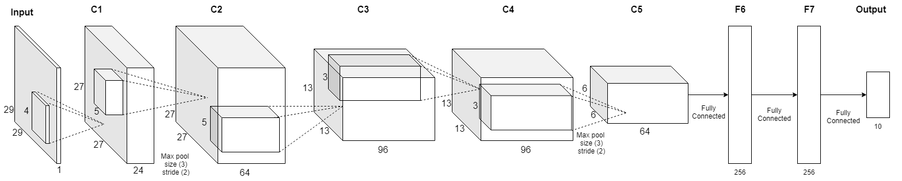

# ACSE-8-Mini-Project

by Richard Boyne, Mattia Guerri, Mio Jiaye

A week-long investigation of various Neural Network structures to classify the Kuzushiji MNIST dataset of ancient Japanese characters. The optimal network was found to be an ensemble of Alexnet variants with test accuracies of 98.8% (within 0.1% the state of the art [ResNet 18 VGG ensumble](https://github.com/ranihorev/Kuzushiji_MNIST)). This was done with two networks containing less than 1 million training parameters (<10% of ResNet18 alone) due to the effective use of data augmentation and k-fold validation (to find optimal epoch termination). A summary of these findings can be found in the reports/Softmax_Report.pdf.

## Repository Structure
* data/ - the given Kuzushiji-MNIST data files
* old_models/ - contains all the different models tested here. These are trained versions along with there predictions. There are also comparison excel spreadsheets between the different models. Naming conventions are a bit all over the place as this was a working space.
* reports/ - has the report, figures and presentation documents
* spec/ - contains admin tools such as mousejuggle.exe to prevent computers from hibernating whilst training
* reports/ - has the report, figures and presentation documents
* training/ - notebooks which define and train all the different models we tested and stored in old_models. Notebooks are not fully commented here as this is a working directory.
* submission/ contains:
  - AlexNet5.ipynb, AlexNet7.ipynb, Ensemble.ipynb - notebooks used to train and combine the final submission network ensemble (see notes below)
  - Ensemble_2.csv, Ensemble_4.csv - final test submissions (submitted under the names "AlexNeyt7_combo (1).csv" and "ensemble (1).csv" respectively)
  - tools.py - common methods for training a neural network and inspecting it as well as a few other commonly used functions such as setting RNG seeds for all packages used or creating the output csv files in the correct format

## Notes on the Optimal Networks
The final two submissions were formed of model ensembles, namely combinations of AlexNet7 and AlexNet5 networks each trained with two different optimisers (Adam and SGD). Either all 4 were combined (Ensemble_4) or just the AlexNet7 networks (Ensemble_2). The notebooks show how the data was loaded, pre-processed and augmented as well as the structures of each network and how they were trained (with the use of tools.py). The Ensemble notebook shows how the models were combined to create our final output.

Below is the structure of the Reduced AlexNet5 used here (AlexNet7 is the same with two additional layers)

## Important Links:

- Team Registration 
https://www.kaggle.com/t/3713b8edcaab4ac7ac6045d7353c1aba

- Kaggle Competition Site + Leaderboard 
https://www.kaggle.com/c/acse-module-8-19/overview
